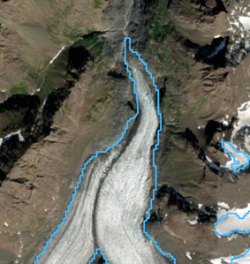

# Global lake-terminating glacier classification: a community effort for the Randolph Glacier Inventory (RGI) and beyond

Written by William Armstrong and Tobias Bolch with contributions from Robert McNabb, Rodrigo Aguayo, Fabien Maussion, 
Jakob Steiner, and Will Kochtitzky

Introductory zoom call (March 4, 2024) where we introduce our main objectives of this work discuss this framework is available here:  https://une.zoom.us/rec/share/vGTjgvBWwBtk3-25jqEh7JCZQtDQEgWg0MZvh3XTHxFyMNR3F3yphsN1FZPwk_kD.HtXAJMD-WNDgmdCX

Knowledge about the existence of lakes which are in contact with glaciers is a fundamental importance to understand as
the lakes increase glacier mass loss due to calving, dynamic thinning and increased mass loss at the ice-water interface
(e.g., King et al. 2019; Tsutaki et al. 2011; 2019; Pronk et al. 2021; Main et a., 2023). Moreover, they impact geodetic mass balance 
calculations as satellites cannot measure subaqueous mass loss (Zhang et al. 2023).

### Motivation

The main aim of this effort is to determine whether a glacier is lake-terminating for the general attribute table
of the Randolph Glacier Inventory (RGI). Uncertain (in case the existence is possible but cannot be determined due to 
unsuitable images) or specific cases (e.g. if a lake is only in contact with a small part of the lake termini) shall 
also be documented. In cases where a glacier is found to be lake-terminating, we seek to provide a qualitative 
“connectivity level” evaluation (akin to Rastner et al., 2012) that users can further parse depending on their needs.

Secondary aims that can partially addressed with this inventory are a classification of morphologies of lake-terminating
versus non-lake-terminating glaciers and the provision of a baseline to identify hotspots where cryosphere risks 
related to potentially expanding lakes (e.g. glacial lake outburst floods) as well as changing aqueous ecologies should
receive future attention. 

These illustrated guidelines will describe the general methodology and provide information about how to decide whether 
a glacier is lake-terminating and how to assess connectivity level to provide consistent attribution for the RGI table.

## 1. Definition and categories of lake-terminating glaciers

For determining whether a glacier is lake-terminating, your guiding question should be “does the glacier end in a 
lake(s) large enough to have the potential to significantly increase the glacier’s mass loss and/or alter glacier 
dynamics?”. This is an inherently subjective determination, and we have developed three confidence levels (described 
below) to promote consistent determination of lake-terminating status across contributors. If you answer “definitely”, 
“probably”, or “possibly” to the question above, you will place it in one of the lake-terminating glacier confidence 
levels. If you answer “no” or “not likely”, this glacier should be considered land- or marine-terminating.

### Non-lake-terminating glacier Category 0: land-terminating

A glacier that is not in direct contact with a lake. A glacier is also NOT lake-terminating, despite there being a 
"glacial lake" close by (i.e., the lake found in landscape formerly covered by and formed glacier ice. These kinds of 
lakes are included in several inventories).

A glacier with supraglacial lakes that have not amalgamated to form one lake that spans the majority of the glacier’s 
terminus should not be considered lake-terminating. Glaciers with proglacial water bodies smaller than 0.01 km2
should not be considered lake-terminating. 

See Examples 12-15:

<table style="width: 800">
  <colgroup>
    <col span="1" style="width: 50%;">
    <col span="1" style="width: 50%;">
  </colgroup>
  <tr>
    <td style="vertical-align: top;"> <b>Example 12:</b> A lake which is in the vicinity of the glaciers but not in contact with the ice. Harris Glacier, Alaska</td>
    <td style="vertical-align: top;"> <b>Example 13:</b> Small supraglacial ponds do NOT make a glacier lake-terminating unless they have coalesced into one or more lakes that are large relative to the glacier width and located at or very near the terminus. Walsh and Logan glaciers (Alaska).</td>
  </tr>
  <tr>
    <td style="vertical-align: top;">  <b>Example 14:</b> The Yukon’s Klutlan Glacier would not be considered lake-terminating. It has a small lake beyond its RGI terminus that does not appear to be in direct contact with glacier ice.</td>
    <td style="vertical-align: top;">  <b>Example 15:</b> For completeness sake, the only water body near Alaska’s Eklutna Glacier’s terminus is its proglacial stream. It is thus not considered a lake-terminating glacier.</td>
  </tr>
</table>

### Lake-terminating glacier Category 1:

The glacier tongue is in contact with one or more small lakes (area > 0.01 km2) that collectively are in 
contact with <~10% of the terminal perimeter. Glaciers in this lake-terminating confidence level will have a lake(s) 
that likely play a relatively minor role in affecting glacier mass loss and flow dynamics. Unclear but likely cases 
should be included in this category. See Exampes 8 and 9:

<table style="width: 800">
  <colgroup>
    <col span="1" style="width: 50%;">
    <col span="1" style="width: 50%;">
  </colgroup>
  <tr>
    <td style="vertical-align: top;"> <b>Example 8:</b> Scattered supraglacial lakes across the terminus area of an Alaska glacier (RGI2000-v7.0-G-01-04360), some of which have merged to form larger lakes.</td>
    <td style="vertical-align: top;"> <b>Example 9:</b> Alaska’s Chisana Glacier has a small lake at its terminus, but it appears fairly shallow (terminus has convex shape into lake) and to be minimally impacting glacier behavior.</td>
  </tr>
</table>

### Lake-terminating glacier Category 2:

The glacier is definitely in direct contact with a lake that spans only a smaller part (clearly less than 50% but more 
than 10%) of the terminus, or with one or more lakes that occur at the side. Glaciers in this lake-terminating 
confidence level will have terminal lakes that may be relevant for upstream glacier mass loss and flow dynamics, but 
it is less certain than in Category 1 cases. See Examples 5-7:

<table style="width: 800">
  <colgroup>
    <col span="1" style="width: 50%;">
    <col span="1" style="width: 50%;">
  </colgroup>
  <tr>
    <td style="vertical-align: top;"> <b>Example 5:</b> Malaspina Glacier (Alaska) has several large lakes at the terminus, but the majority of the terminus is in contact with land.</td>
    <td style="vertical-align: top;"> <b>Example 6:</b> Southern Inylchek Glacier, Kyrgyzstan. The end of the tongue is land-terminating. However, a large part of the active tongue is flowing towards a lake, impacting the glacier behavior.</td>
  </tr>
  <tr>
    <td style="vertical-align: top;"> <b>Example 7:</b> Russell Glacier (Alaska) has a large (relative to the glacier width) lake near the terminus that spans <50% of the terminal perimeter.</td>
    <td style="vertical-align: top;"></td>
  </tr>
</table>

### Lake-terminating glacier Category 3:

The glacier is definitely in direct contact with a large lake that spans at least  ~50% of the glacier terminus. Lakes 
smaller than 0.01 km2 should not be considered. Glaciers in this lake-terminating confidence level will have 
a lake that is large enough (relative to the glacier width/terminal perimeter) that it very likely is capable of 
affecting upstream glacier mass loss and flow dynamics. See Examples 1-4:

<table style="width: 800">
  <colgroup>
    <col span="1" style="width: 50%;">
    <col span="1" style="width: 50%;">
  </colgroup>
  <tr>
    <td style="vertical-align: top;"> <b>Example 1:</b> Category 3 lake-terminating glacier, example 1: Skilak Glacier in Alaska. The RGI 7.0 outline (blue) intersects the 2000 lake outline (red), with the entire terminus in contact with the proglacial lake. The base image is from 2018 and the lake outline is from Rick et al. (2022)</td>
    <td style="vertical-align: top;"> <b>Example 2:</b> Category 3 lake-terminating glacier, example 2: Imje/Lhotse Shar Glacier, Khumbu Himalaya.</td>
  </tr>
  <tr>
    <td style="vertical-align: top;">  <b>Example 3:</b> A Category 3 lake-terminating  glacier (Knik Glacier, Alaska), where ~50% of the glacier terminus is in visible contact with a proglacial lake. The terminus appears fairly flat, features prominent rifts extending from the lake, and further glacier retreat seems likely to result in lake expansion, suggesting a deep and dynamically-relevant lake.</td>
    <td style="vertical-align: top;">  <b>Example 4:</b> A collection of Category 3 lake-terminating glaciers ending in Alsek Lake, Alaska. The entirety of each glacier’s terminus is in contact with lake water.</td>
  </tr>
</table>

### Ambiguous lake termini

*Streams cutting across termini* are Category 2 in cases where the stream has a clear impact on ice melt and dynamics, 
otherwise they should be Category 1. See Examples 10 and 11:

<table style="width: 800">
  <colgroup>
    <col span="1" style="width: 50%;">
    <col span="1" style="width: 50%;">
  </colgroup>
  <tr>
    <td style="vertical-align: top;"> <b>Example 10:</b> The terminus of Childs Glacier (Alaska) is cut across by the Copper River, featuring embayments where calving seems to occur. This would be considered a Category 2 lake-terminating glacier.</td>
    <td style="vertical-align: top;"> <b>Example 11:</b> The terminus of Tweedsmuir Glacier (Yukon) is cut across by the Alsek River, but there appears to be limited interaction between the river and glacier. This would be a Category 1 lake-terminating glacier. </td>
  </tr>
</table>

## 2. Methodology

We rely on the best possible existing lake inventory for any region that is most closely matching the 2000 time stamp. 
If an inventory is lacking or too far removed in time from 2000 (>10 years away) the classification is done manually 
based on satellite imagery from 2000. If neither of these approaches are taken, all glaciers in that region are flagged 
as ‘not assigned’ terminus type (term_type = 9).

> :warning: **Important note: When in doubt, put the glacier in the lower number connectivity category 
(i.e., higher relevance; Category 2 instead of Category 1).**

> :warning: **Important note: If you reviewed a glacier or region and determined that certain glaciers 
are definitely NOT lake-terminating (Category 0), please indicate that on your data submission (Section 3). A list that 
includes exclusively glaciers that are definitely not lake-terminating is helpful in its own right.**

### Workflow using existing lake inventory

We have provided a Python script (`assignRgiLakeFlag_minimal.py`, included in the `scripts` folder) that utilizes an existing ice-marginal 
lake inventory to produce a limited subset of RGI glaciers that should be manually verified for lake-terminating status.

We have compiled a list of known [datasets here](https://github.com/GLIMS-RGI/lake_terminating/blob/main/Lake_databases_termini.csv).

The general workflow implemented in the script is:

1. create a geodatabase of terminus locations, pulling the `term_lat` and `term_lon` fields from the RGI outlines;
2. buffer the terminus positions by 1 km;
3. use a spatial join to join the existing lake dataset and the buffered RGI terminus positions, assigning any glacier 
   the join a `term_type` of 2 ("Lake-terminating").

Contributors should then manually verify the collection of lake-terminating glaciers and assign lake-terminating relevance
categories, based on the examples above and the following general criteria:

- Not lake-terminating, Category 0: The glacier is not lake-terminating; its terminus is almost exclusively in contact with
  land (or the ocean), or has a terminal water body that is so small as to seem inconsequential for its mass loss/dynamics
- Lake-terminating Category 1: <~10% of terminus is adjacent to lake, but there is some reason to think the lake is 
  possibly dynamically relevant.
- Lake-terminating Category 2: ~10 - ~50% of terminus is adjacent to lake; the lake(s) is probably relevant for glacier 
  mass loss and dynamics
- Lake-terminating Category 3: >~50% of terminus is adjacent to lake; the lake(s) is definitely relevant for glacier mass 
  loss and dynamics
- Supraglacial lakes (lakes forming entirely on top of glacier ice) should not to be considered unless they have coalesced 
  into large water bodies than span the majority of the terminus
- Lakes smaller than 0.01 km2 should not be considered
- Glaciers with terminus cut across by a stream should be labeled as Category 1 or 2 (see guidance under “ambiguous termini” 
  above)
- When in doubt whether the glacier is in contact with a lake or not, use Category 1; if it seems more likely that the 
  glacier is not in contact but you cannot verify from the utilized image or any other image source (e.g. because of 
  clouds, snow cover, cast shadow), use the "not assigned" category (`term_type`=9)
- Recall that a list of definitively not lake-terminating glacier (lake category = 0) is very useful in its own right

> :warning: **We strongly urge contributors to use the 0 - 3 lake-terminating categories defined above**, but will accept 
binary submissions ("lake-terminating"/"not lake-terminating") as well. If you are performing a binary lake-terminating 
classification, please consider the above-defined Categories 2 & 3 as “yes”, and 
**please make it clear in your contribution that you did a binary classification**.

### Workflow without an existing lake inventory

In cases where no prior ice-marginal lake dataset exists, the user will have to manually inspect the termini of glaciers 
in your region to determine whether the glacier is lake-terminating, using the examples above the general criteria 
summarized in the preceding section. The [RGI version 7](https://www.glims.org/RGI/) should be used as a starting point
for glacier extents, and satellite imagery used to determine lake-terminating status should come from as close to the 
year 2000 as possible (within 10 years at most).

## 3. Output data format

The contributors to the lake inventory should provide a csv file with the following structure (a sample template,
`lake_term_data_template.csv`, is provided in this repository):

| `rgi_id`                | `lake_terminating_level` |                `image_id`                | `image_date` |          `inventory_doi`           | `contributor` |
|-------------------------|:------------------------:|:----------------------------------------:|:------------:|:----------------------------------:|:-------------:|
| RGI2000-v7.0-G-01-08604 |            1             | LT05_L1TP_066017_19990927_20200907_02_T1 | 1999/09/27   | https://doi.org/10.18739/A2MK6591G |  Armstrong    |

The fields are defined as:

- `rgi_id`: the glacier ID from the RGI version 7
- `lake_terminating_level`: the lake terminating category, as defined in the previous section
- `image_id`: The ID of the image used to verify and/or decide about the lake-terminating category. For Landsat images,
  please use the **Product Identifier**.
- `image_date`: The acquisition date of the image used to verify and/or decide about the lake-terminating level, in 
  YYYY/MM/DD format.
- `inventory_doi`: the DOI of the lake dataset used (if exisiting), otherwise blank/NA
- `contributor`: The name of the person(s) who checked the lake-terminating category. More than one person may be included
  here, but the person who checked the category must be named, and not just the supervisor or data provider.

> :warning: As stated above, **we strongly urge contributors to use the 0 - 3 lake-terminating categories defined above**, but
we are happy to accept binary submissions as well. **If you are performing a binary lake-terminating classification, 
please consider the above-defined Categories 2 & 3 as "yes", and please make it clear in your contribution that you did 
a binary classification**.

These regional tables will be merged to produce a global table of lake-terminating glaciers that will then be merged 
with the existing RGI tables and shapefiles.

Thank you for your time and effort! Please contact William Armstrong ([armstrongwh@appstate.edu](mailto:armstrong@appstate.edu)) 
and/or Tobias Bolch ([tobias.bolch@tugraz.at](mailto:tobias.bolch@tugraz.at)) with any issues or questions.

## 4. References

- King, Owen, Atanu Bhattacharya, Rakesh Bhambri, and Tobias Bolch. 2019. “Glacial Lakes Exacerbate Himalayan Glacier Mass Loss.” 
  *Scientific Reports* 9(1), 18145. https://doi.org/10.1038/s41598-019-53733-x
- Main, Brittany, Luke Copland, Braden Smeda, Will Kochtitzky, Sergey Samsonov, Jonathan Dudley, Mark Skidmore et al. 2023. "Terminus change of Kaskawulsh Glacier, Yukon, under a warming climate: retreat, thinning, slowdown and modified proglacial lake geometry." *Journal of Glaciology* 69(276):936-952. https://doi.org/10.1017/jog.2022.114
- Pronk, Jan Bouke, Tobias Bolch, Owen King, Bert Wouters, and Douglas I. Benn. 2021. "Contrasting Surface Velocities between Lake- and Land-Terminating Glaciers in the Himalayan Region."
  *The Cryosphere* 15(12), 5577–99. https://doi.org/10.5194/tc-15-5577-2021
- Rastner, P., Bolch, T., Mölg, N., Machguth, H., Le Bris, R., Paul, F., 2012. "The first complete inventory of the local glaciers and ice caps on Greenland". 
  *The Cryosphere* 6, 1483–1495. https://doi.org/10.5194/tc-6-1483-2012
- Rick, Brianna, Daniel McGrath, William Armstrong, and Scott W. McCoy. 2022. "Dam type and lake location characterize ice-marginal lake area change in Alaska and NW Canada between 1984 and 2019." 
  *The Cryosphere* 16(1), 297-314. https://doi.org/10.5194/tc-16-297-2022
- Tsutaki, Shun, Koji Fujita, Takayuki Nuimura, Akiko Sakai, Shin Sugiyama, Jiro Komori, and Phuntsho Tshering. 2019. “Contrasting Thinning Patterns between Lake- and Land-Terminating Glaciers in the Bhutanese Himalaya.” 
  *The Cryosphere* 13(10), 2733–50. https://doi.org/10.5194/tc-13-2733-2019
- Tsutaki, Shun, Daisuke Nishimura, Takeshi Yoshizawa, and Shin Sugiyama. 2011. “Changes in Glacier Dynamics under the Influence of Proglacial Lake Formation in Rhonegletscher, Switzerland.” 
  *Annals of Glaciology* 52(58), 31–36. https://doi.org/10.3189/172756411797252194
- Zhang, Guoqing, Tobias Bolch, Tandong Yao, David R. Rounce, Wenfeng Chen, Georg Veh, Owen King, Simon K. Allen, Mengmeng Wang, and Weicai Wang. 2023. “Underestimated Mass Loss from Lake-Terminating Glaciers in the Greater Himalaya.” 
  *Nature Geoscience* 16(4), 333–38. https://doi.org/10.1038/s41561-023-01150-1
