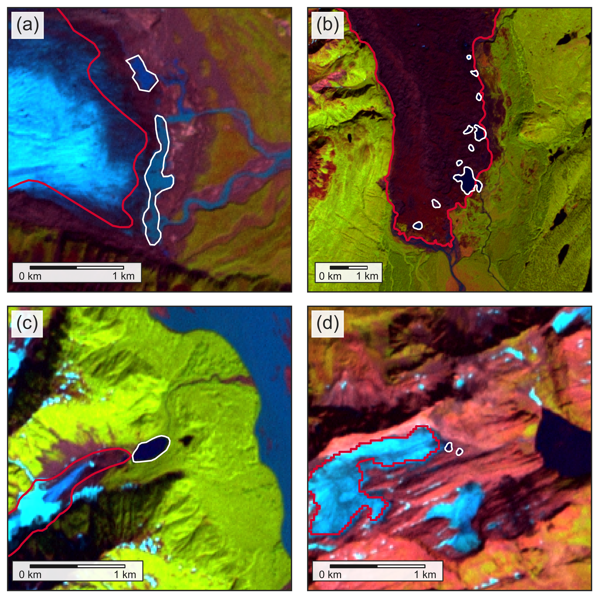
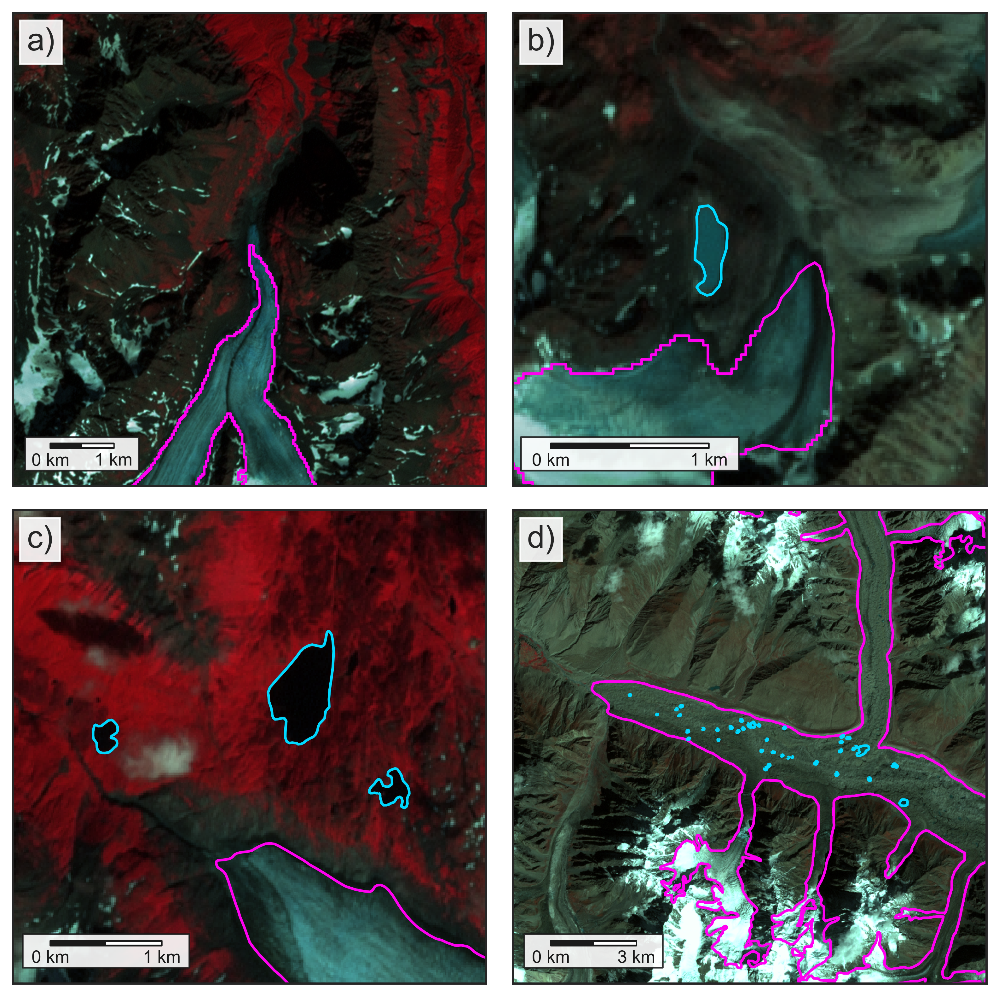

# Global lake-terminating glacier classification: a community effort for the Randolph Glacier Inventory (RGI) and beyond

Written by William Armstrong and Tobias Bolch with contributions from Robert McNabb, Rodrigo Aguayo, Fabien Maussion, 
Jakob Steiner, and Will Kochtitzky

Introductory zoom call (March 4, 2024) where we introduce our main objectives of this work discuss this framework is
available [via this link](https://une.zoom.us/rec/share/vGTjgvBWwBtk3-25jqEh7JCZQtDQEgWg0MZvh3XTHxFyMNR3F3yphsN1FZPwk_kD.HtXAJMD-WNDgmdCX).

Knowledge about the existence of lakes which are in contact with glaciers is a fundamental importance to understand as
the lakes increase glacier mass loss due to calving, dynamic thinning and increased mass loss at the ice-water interface
(e.g., King et al. 2019; Tsutaki et al. 2011; 2019; Pronk et al. 2021; Main et al., 2023). Moreover, they impact 
geodetic mass balance calculations as satellites cannot measure subaqueous mass loss (Zhang et al. 2023).

## Motivation

The main aim of this effort is to determine whether a glacier is lake-terminating for the general attribute table
of the Randolph Glacier Inventory (RGI). Uncertain (in case the existence is possible but cannot be determined due to 
unsuitable images) or specific cases (e.g. if a lake is only in contact with a small part of the lake termini) shall 
also be documented. In cases where a glacier is found to be lake-terminating, we seek to provide a qualitative 
“connectivity category” evaluation (akin to Rastner et al., 2012) that users can further parse depending on their needs.

Secondary aims that can partially addressed with this inventory are a classification of morphologies of lake-terminating
versus non-lake-terminating glaciers and the provision of a baseline to identify hotspots where cryosphere risks 
related to potentially expanding lakes (e.g. glacial lake outburst floods) as well as changing aqueous ecologies should
receive future attention. 

These illustrated guidelines will describe the general methodology and provide information about how to decide whether 
a glacier is lake-terminating and how to assess the lake-terminating connectivity category to provide consistent
attribution for the RGI table.

## Dataset

The `dataset/` folder has the following structure:

```
dataset/
├─ contributor_files/
    └─ RGI-v7.0-G-{region}/
        ├─ RGI-v7.0-G-{region}_{contributor}.csv
├─ csv/
    └─ RGI-v7.0-G-{region}_lakeflag.csv
├─ lakeflags/
    └─ RGI-v7.0-G-{region}_lakeflag.gpkg
└─ outlines/
    └─ RGI-v7.0-G-{region}_laketerminating.gpkg
```

Where:
- `contributor_files/` contains all of the original/individual submissions provided by different contributors
- `csv/` contains a `.csv` file for each RGI region
- `lakeflags/` contains a `.gpkg` file for each RGI region, with the geometry set to the RGI7 centroid latitude/longitude
- `outlines/` contains a `.gpkg` file for each RGI region, with the geometry set to the RGI7 outline, but only for
  glaciers categorized as lake-terminating category 1-3.

Each of the files in the dataset folders contains the following fields:
- `rgi_id` - the RGI7 ID for the glacier;
- `lake_cat` - the lake-terminating category for the glacier, as defined below;
- `image_id` - the ID of the image that was used to classify each glacier;
- `image_date` - the date (or date range) of the image used to classify each glacier;
- `inventory_doi` - the DOI of the lake inventory (if used)
- `contributor` - the ID of the contributor(s) who classified the glacier
- `notes` - any additional notes from each contributor

The `.gpkg` files contained in the `lakeflags/` and `outlines/` directories are generated from the `.csv` files and the
RGI outlines using `scripts/generate_geopackage.py`.

## Contributing

The classifications provided here are the result of a community effort, which means that there may be disagreement 
between analysts. If you find any such issues, we invite you to submit your updates/corrections by first forking this
repository and submitting a Pull Request (https://github.com/GLIMS-RGI/lake_terminating/pulls).

Alternatively, you are welcome to open an issue for further discussion (https://github.com/GLIMS-RGI/lake_terminating/issues). 

## 1. Definition and categories of lake-terminating glaciers

For determining whether a glacier is lake-terminating, your guiding question should be “does the glacier end in a 
lake(s) large enough to have the potential to significantly increase the glacier’s mass loss and/or alter glacier 
dynamics?”. This is an inherently subjective determination, and we have developed three category definitions (described 
below) to promote consistent determination of lake-terminating status across contributors. If you answer “definitely”, 
“probably”, or “possibly” to the question above, you will place it in one of the lake-terminating glacier categories. 
If you answer “no” or “not likely”, this glacier should be considered land- or marine-terminating.

### Lake-terminating glacier Level 1: lake is <ins>definitely</ins> relevant for glacier behavior

The glacier is in direct contact with a lake that spans at least 50 % of the terminal perimeter (planimetric length of 
the glacier terminus), based on a visual assessment. Glaciers in this category have a lake that is large
enough relative to the glacier width/terminal perimeter to have a visible impact on the glacier. Visual indicators of
this category may include a calving front, crevasses, and/or icebergs.


*Background images are Landsat 7 ETM+ false-color composites (bands 5, 4, 3). RGI7 outlines are shown in red, while lake 
outlines are shown in white. (a) Alsek Glacier (RGI2000-v7.0-G-01-16980) in Alaska (region 01). Landsat image acquired 
2000-08-10. (b) Knik Glacier (RGI2000-v7.0-G-01-10684) in Alaska (region 01). Landsat image acquired 1999-07-31. 
(c) Skilak Glacier (RGI2000-v7.0-G-01-08014) in Alaska (region 01). Landsat image acquired 2000-08-09. 
(d) Lhotse Shar Glacier (RGI2000-v7.0-G-15-06763) in South Asia East (region 15). Landsat image acquired 2000-10-30.*

### Lake-terminating glacier Level 2: lake is <ins>probably</ins> relevant for glacier behavior

The glacier is in direct contact with a lake that spans a smaller part (clearly less than 50 % but more than 10 % by 
visual assessment) of the terminus, or with one or more disjointed lakes that occur along the glacier margin. Potential 
indicators of this category included a calving front, crevasses, and/or icebergs, but are less certain than in 
Category 3 cases.


*Background images are Landsat 7 ETM+ false-color composites (bands 5, 4, 3). RGI7 outlines are shown in red, while lake
outlines are shown in white. (a) Malaspina (Sít' Tlein) Glacier (RGI2000-v7.0-G-01-15261) in Alaska (region 01). Landsat
image acquired 2000-09-09. (b) Russel Glacier (RGI2000-v7.0-G-01-16437) in Alaska (region 01). Landsat image acquired
2000-08-31. (c) Inilchek Glacier (RGI2000-v7.0-G-13-28434) in Central Asia (region 13). Landsat image acquired
2000-09-13. The main lake is not in the regional lake inventory but is visible in satellite imagery (and a known lake
that is present most of the time but repeatedly drains as a glacial lake outburst flood). (d) Middle Fork Glacier
(RGI2000-v7.0-G-01-06125) in Alaska (region 01). Landsat image acquired 1999-08-11.*

### Lake-terminating glacier Level 3: lake is <ins>possibly</ins> relevant for glacier behvaiour

The glacier is in contact with one or more small lakes (area >0.01 km<sup>2</sup>) that collectively are in contact with
<10 % of the terminal perimeter. Glaciers in this category do not have visible impacts due to the lake 
except along a very limited (<10 %) portion of the terminus. Cases that are unclear but likely are also included in this 
category. Additionally, we included cases where glaciers have multiple or unclear termini (e.g. ice cap margins) in this
category, if expert judgment considered the adjacent lakes not relevant for glacier dynamics.


*Background images are Landsat 7 ETM+ false-color composites (bands 5, 4, 3). RGI7 outlines are shown in red, while lake
outlines are shown in white. (a) Chisana Glacier (RGI2000-v7.0-G-01-05589) in Alaska (region 01). Landsat image acquired
1999-08-11. (b) Unnamed glacier (RGI2000-v7.0-G-01-04360) in Alaska (region 01). Landsat image acquired 2000-08-16.
(c) Unnamed glacier (RGI2000-v7.0-G-01-16871) in Alaska (region 01). Landsat image acquired 2000-08-10. (d) Ghiaccio 
del Cavagn (RGI2000-v7.0-G-11-02473) in Central Europe (region 11). Landsat image acquired 2000-08-28.*


### Ambiguous lake termini

*Streams cutting across termini* are Category 2 in cases where the stream has a clear impact on ice melt and dynamics, 
otherwise they should be Category 1. In panel (a) below, the terminus of Childs Glacier (Alaska) is cut across by the
Copper River, featuring embayments where calving seems to occur. This would be considered a Category 2 lake-terminating 
glacier. 

In panel (b), the terminus of Tweedsmuir Glacier (Yukon) is cut across by the Alsek River, but there appears to be 
limited interaction between the river and glacier. This would be a Category 1 lake-terminating glacier.


*Background images are Landsat 7 ETM+ false-color composites (bands 5, 4, 3). RGI7 outlines are shown in red, while lake
outlines are shown in white. (a) Childs Glacier (RGI2000-v7.0-G-01-11603) in Alaska (region 01). Landsat image acquired
2000-07-03. (b) Tweedsmuir Glacier (RGI2000-v7.0-G-01-14859) in Alaska (region 01). Landsat image acquired 2000-08-10.*


### Non-lake-terminating glacier Level 0: land-terminating

The glacier is not lake-terminating; its terminus is almost exclusively in contact with land or the ocean, or has a 
terminal water body that is so small as to seem inconsequential. We did not consider glaciers with supraglacial lakes 
that have not amalgamated to form one lake spanning the majority of the glacier’s terminus to be lake-terminating. 

Similarly, we did not consider glaciers with proglacial water bodies smaller than 0.01 km<sup>2</sup> to be 
lake-terminating.


*Background images are Landsat 7 ETM+ false-color composites (bands 5, 4, 3). RGI7 outlines are shown in red, while lake
outlines are shown in white. (a) Eklutna Glacier (RGI2000-v7.0-G-01-10928) in Alaska. Landsat image acquired 1999-07-31.
(b) Unnamed glacier (RGI2000-v7.0-G-01-11048) in Alaska (region 01). Landsat image acquired 1999-07-31. (c) Harris
Glacier (RGI2000-v7.0-G-01-08628) in Alaska (region 01). Landsat image acquired 2000-08-09. (d) Hispar Glacier, with 
numerous supraglacial ponds (RGI2000-v7.0-G-14-21670) in South Asia West (region 14). Landsat image acquired 2000-09-11.

## 2. Methodology

We rely on the best possible existing lake inventory for any region that is most closely matching the 2000 time stamp. 
If an inventory is lacking or too far removed in time from 2000 (>10 years away) the classification is done manually 
based on satellite imagery from 2000. If neither of these approaches are taken, all glaciers in that region are flagged 
as ‘not assigned’ terminus type (term_type = 9).

> :warning: **Important note: When in doubt, put the glacier in the higher category 
(i.e., higher relevance; Category 2 instead of Category 1).**

> :warning: **Important note: If you reviewed a glacier or region and determined that certain glaciers 
are definitely NOT lake-terminating (Category 0), please indicate that on your data submission (Section 3). A list that 
includes exclusively glaciers that are definitely not lake-terminating is helpful in its own right.**

### Workflow using existing lake inventory

We have provided a Python script (`assignRgiLakeFlag_minimal.py`, included in the `scripts` folder) that utilizes an existing ice-marginal 
lake inventory to produce a limited subset of RGI glaciers that should be manually verified for lake-terminating status.

We have compiled a list of known [datasets here](https://github.com/GLIMS-RGI/lake_terminating/blob/main/Lake_databases_termini.csv).

The general workflow implemented in the script is:

1. create a geodatabase of terminus locations, pulling the `term_lat` and `term_lon` fields from the RGI outlines;
2. buffer the terminus positions by 1 km;
3. use a spatial join to join the existing lake dataset and the buffered RGI terminus positions, assigning any glacier 
   the join a `term_type` of 2 ("Lake-terminating").

Contributors should then manually verify the collection of lake-terminating glaciers and assign lake-terminating relevance
categories, based on the examples and definitions above.

> :warning: **We strongly urge contributors to use the 0 - 3 lake-terminating categories defined above**, but will accept 
binary submissions ("lake-terminating"/"not lake-terminating") as well. If you are performing a binary lake-terminating 
classification, please consider the above-defined categories 3 & 2 as “yes”, and 
**please make it clear in your contribution that you did a binary classification**.

### Workflow without an existing lake inventory

In cases where no prior ice-marginal lake dataset exists, the user will have to manually inspect the termini of glaciers 
in your region to determine whether the glacier is lake-terminating, using the examples above the general criteria 
summarized in the preceding section. The [RGI version 7](https://www.glims.org/RGI/) should be used as a starting point
for glacier extents, and satellite imagery used to determine lake-terminating status should come from as close to the 
year 2000 as possible (within 10 years at most).

## 3. Output data format

The contributors to the lake inventory should provide a csv file with the following structure (a sample template,
`lake_term_data_template.csv`, is provided in this repository):

| `rgi_id`                | `lake_cat` |                `image_id`                | `image_date` |          `inventory_doi`           | `contributor` |
|-------------------------|:----------:|:----------------------------------------:|:------------:|:----------------------------------:|:-------------:|
| RGI2000-v7.0-G-01-08604 |     1      | LT05_L1TP_066017_19990927_20200907_02_T1 | 1999/09/27   | https://doi.org/10.18739/A2MK6591G |  Armstrong    |

The fields are defined as:

- `rgi_id`: the glacier ID from the RGI version 7
- `lake_cat`: the lake terminating category, as defined in the previous section
- `image_id`: The ID of the image used to verify and/or decide about the lake-terminating category. For Landsat images,
  please use the **Product Identifier**.
- `image_date`: The acquisition date of the image used to verify and/or decide about the lake-terminating category, in 
  YYYY/MM/DD format.
- `inventory_doi`: the DOI of the lake dataset used (if exisiting), otherwise blank/NA
- `contributor`: The name of the person(s) who checked the lake-terminating category. More than one person may be included
  here, but the person who checked the category must be named, and not just the supervisor or data provider.

> :warning: As stated above, **we strongly urge contributors to use the 0 - 3 lake-terminating categories defined above**, but
we are happy to accept binary submissions as well. **If you are performing a binary lake-terminating classification, 
please consider the above-defined Categories 3 & 2 as "yes", and please make it clear in your contribution that you did 
a binary classification**.

These regional tables will be merged to produce a global table of lake-terminating glaciers that will then be merged 
with the existing RGI tables and shapefiles.

Thank you for your time and effort! Please contact William Armstrong ([armstrongwh@appstate.edu](mailto:armstrong@appstate.edu)) 
and/or Tobias Bolch ([tobias.bolch@tugraz.at](mailto:tobias.bolch@tugraz.at)) with any issues or questions.

## 4. References

- King, Owen, Atanu Bhattacharya, Rakesh Bhambri, and Tobias Bolch. 2019. “Glacial Lakes Exacerbate Himalayan Glacier Mass Loss.” 
  *Scientific Reports* 9(1), 18145. https://doi.org/10.1038/s41598-019-53733-x
- Main, Brittany, Luke Copland, Braden Smeda, Will Kochtitzky, Sergey Samsonov, Jonathan Dudley, Mark Skidmore et al. 2023. "Terminus change of Kaskawulsh Glacier, Yukon, under a warming climate: retreat, thinning, slowdown and modified proglacial lake geometry." *Journal of Glaciology* 69(276):936-952. https://doi.org/10.1017/jog.2022.114
- Pronk, Jan Bouke, Tobias Bolch, Owen King, Bert Wouters, and Douglas I. Benn. 2021. "Contrasting Surface Velocities between Lake- and Land-Terminating Glaciers in the Himalayan Region."
  *The Cryosphere* 15(12), 5577–99. https://doi.org/10.5194/tc-15-5577-2021
- Rastner, P., Bolch, T., Mölg, N., Machguth, H., Le Bris, R., Paul, F., 2012. "The first complete inventory of the local glaciers and ice caps on Greenland". 
  *The Cryosphere* 6, 1483–1495. https://doi.org/10.5194/tc-6-1483-2012
- Rick, Brianna, Daniel McGrath, William Armstrong, and Scott W. McCoy. 2022. "Dam type and lake location characterize ice-marginal lake area change in Alaska and NW Canada between 1984 and 2019." 
  *The Cryosphere* 16(1), 297-314. https://doi.org/10.5194/tc-16-297-2022
- Tsutaki, Shun, Koji Fujita, Takayuki Nuimura, Akiko Sakai, Shin Sugiyama, Jiro Komori, and Phuntsho Tshering. 2019. “Contrasting Thinning Patterns between Lake- and Land-Terminating Glaciers in the Bhutanese Himalaya.” 
  *The Cryosphere* 13(10), 2733–50. https://doi.org/10.5194/tc-13-2733-2019
- Tsutaki, Shun, Daisuke Nishimura, Takeshi Yoshizawa, and Shin Sugiyama. 2011. “Changes in Glacier Dynamics under the Influence of Proglacial Lake Formation in Rhonegletscher, Switzerland.” 
  *Annals of Glaciology* 52(58), 31–36. https://doi.org/10.3189/172756411797252194
- Zhang, Guoqing, Tobias Bolch, Tandong Yao, David R. Rounce, Wenfeng Chen, Georg Veh, Owen King, Simon K. Allen, Mengmeng Wang, and Weicai Wang. 2023. “Underestimated Mass Loss from Lake-Terminating Glaciers in the Greater Himalaya.” 
  *Nature Geoscience* 16(4), 333–38. https://doi.org/10.1038/s41561-023-01150-1
