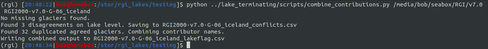
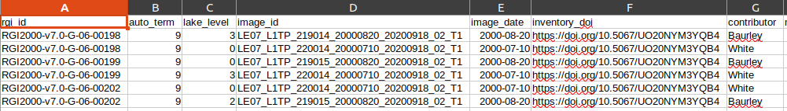
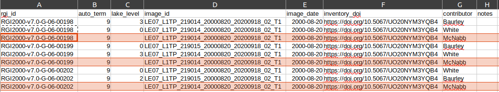
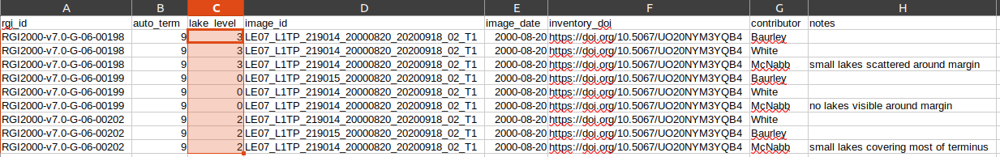
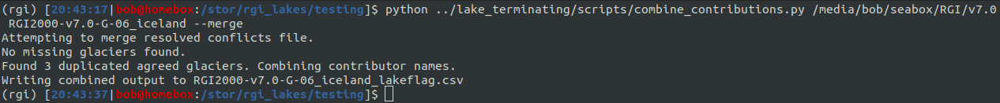

# merging conflicts

After running `scripts/combine_contributions.py` to combine the contributions from multiple contributors, you may
find that you have a number of conflicts, where different contributors have disagreed about the `lake_level` flag
for one or more glaciers, as in this example:

To resolve the conflict, open `{region}_conflicts.csv`:

The goal here is to resolve the conflict by ensuring that the `lake_level` for each conflicted glacier is the same,
based on some kind of consensus or check. 

If you are not one of the named contributors, make sure to add an additional row for each glacier before assigning
the new consensus values:

Then, edit the `lake_level` so that each row for each glacier has the same agreed value:

If you are already one of the named contributors, you don't need to add the additional rows - this is done only to
keep track of what contributors have been involved in making the decision for each glacier.

Once all conflicts in the file have been resolved, save the changes and re-run `scripts/combine_contributions.py`, 
this time with the `--merge` flag:

Once this is done, and there are no missing or conflicted glaciers left, remember to add the `{region}_lakeflag.csv`
file to GitHub.