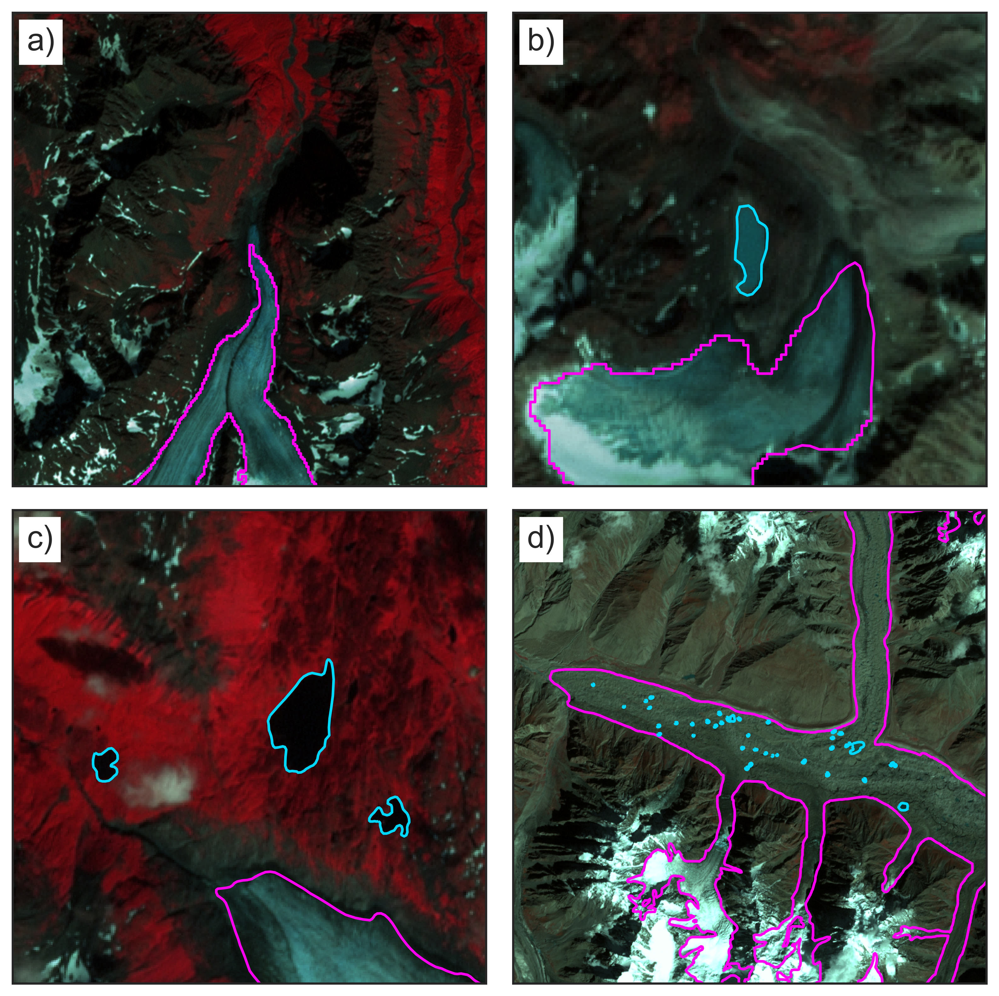
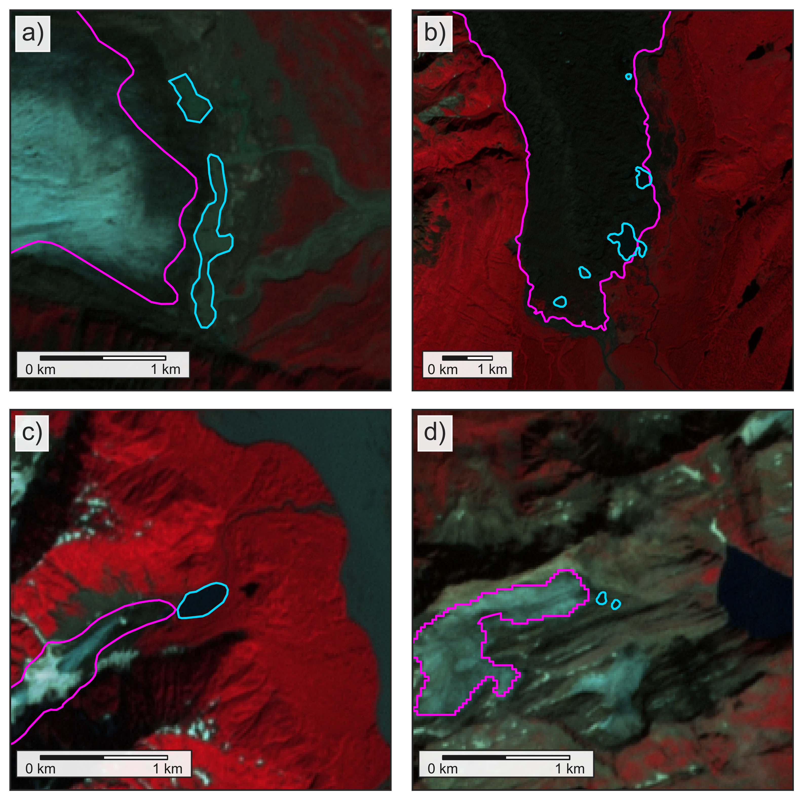
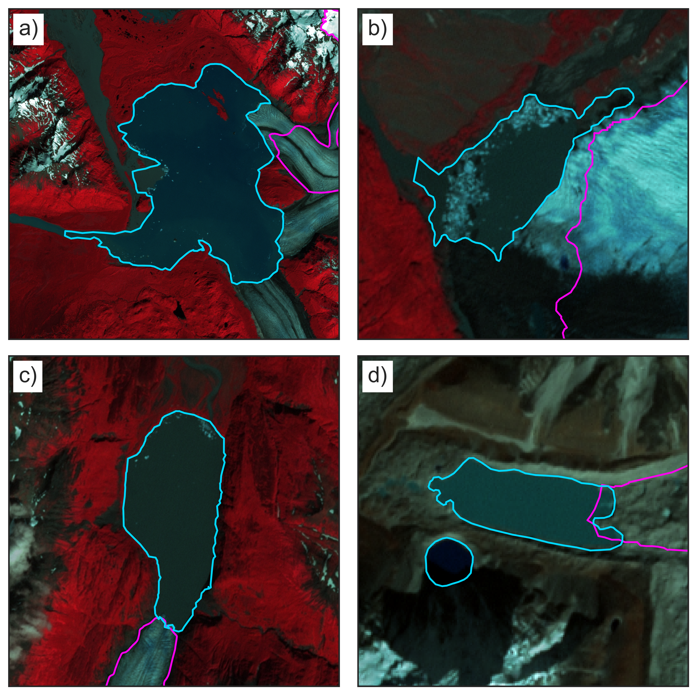
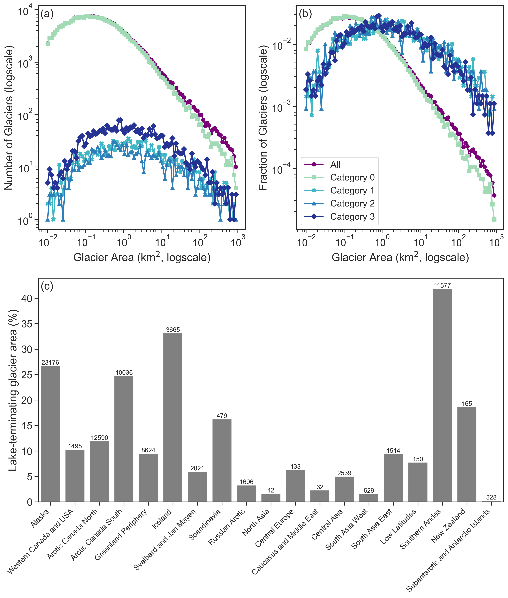
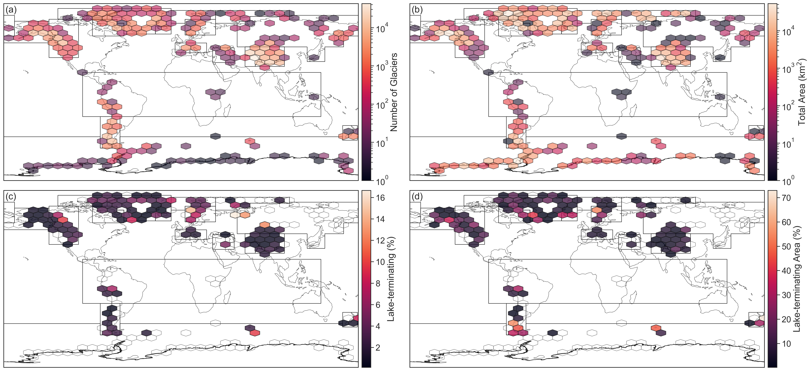
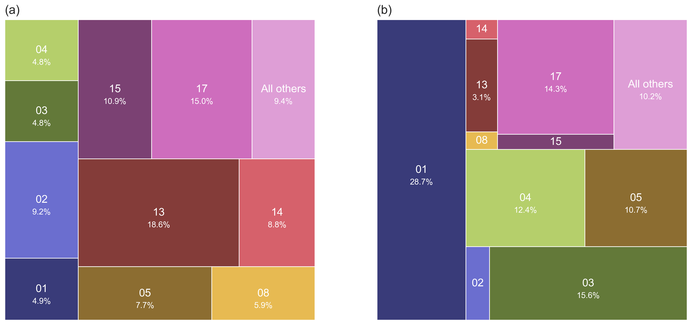
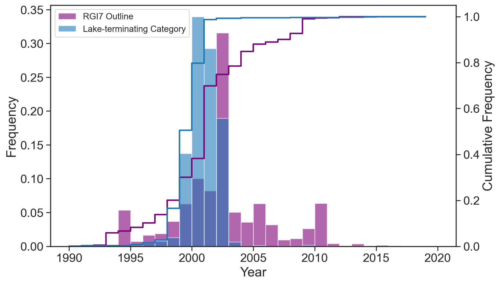

# Global mapping of lake-terminating glaciers

This folder contains the scripts, figures, and tables generated for the
ESSD submission of the global lake-terminating glacier mapping effort.

The figures are shown below, along with the caption for each from the
manuscript:

**Fig. 1**: Examples of lake-terminating Category 0 glacier termini. Background images
are Landsat 7 ETM+ false-color composites (bands 5, 4, 3). RGI7 outlines are shown 
in red, while lake outlines are shown in white. (a) Eklutna Glacier 
(RGI2000-v7.0-G-01-10928) in Alaska.Landsat image acquired 1999-07-31. (b) Unnamed 
glacier (RGI2000-v7.0-G-01-11048) in Alaska (region 01). Landsat image acquired 1999-07-31.
(c) Harris Glacier (RGI2000-v7.0-G-01-08628) in Alaska (region 01). Landsat image acquired 
2000-08-09. (d) Hispar Glacier, with numerous supraglacial lakes (RGI2000-v7.0-G-14-21670)
in South Asia West (region 14). Landsat image acquired 2000-09-11.

&nbsp;

**Fig. 2**: Examples of lake-terminating Category 1 glacier termini. Background images
are Landsat 7 ETM+ false-color composites (bands 5, 4, 3). RGI7 outlines are shown
in red, while lake outlines are shown in white. (a) Chisana Glacier 
(RGI2000-v7.0-G-01-05589) in Alaska (region 01). Landsat image acquired 1999-08-11. 
(b) Unnamed glacier (RGI2000-v7.0-G-01-04360) in Alaska (region 01). Landsat image 
acquired 2000-08-16. (c) Unnamed glacier (RGI2000-v7.0-G-01-16871) in Alaska 
(region 01). Landsat image acquired 2000-08-10. (d) Ghiaccio del Cavagn 
(RGI2000-v7.0-G-11-02473) in Central Europe (region 11). Landsat image acquired 
2000-08-28.

&nbsp;

**Fig. 3**: Examples of lake-terminating Category 2 glacier termini. Background images 
are Landsat 7 ETM+ false-color composites (bands 5, 4, 3). RGI7 outlines are shown 
in red, while lake outlines are shown in white. (a) Malaspina (Sít' Tlein) Glacier 
(RGI2000-v7.0-G-01-15261) in Alaska (region 01). Landsat image acquired 2000-09-09. 
(b) Russel Glacier (RGI2000-v7.0-G-01-16437) in Alaska (region 01). Landsat image 
acquired 2000-08-31. (c) Inilchek Glacier (RGI2000-v7.0-G-13-28434) in Central Asia 
(region 13). Landsat image acquired 2000-09-13. The main lake is not in the regional
lake inventory but is visible in satellite imagery (and a known lake that is present
most of the time but repeatedly drains as a glacial lake outburst flood). (d) Middle 
Fork Glacier (RGI2000-v7.0-G-01-06125) in Alaska (region 01). Landsat image acquired 
1999-08-11.

&nbsp;

**Fig. 4**: Examples of lake-terminating Category 3 glacier termini. Background images
are Landsat 7 ETM+ false-color composites (bands 5, 4, 3). RGI7 outlines are shown 
in red, while lake outlines are shown in white. (a) Alsek Glacier 
(RGI2000-v7.0-G-01-16980) in Alaska (region 01). Landsat image acquired 2000-08-10. 
(b) Knik Glacier (RGI2000-v7.0-G-01-10684) in Alaska (region 01). Landsat image 
acquired 1999-07-31. (c) Skilak Glacier (RGI2000-v7.0-G-01-08014) in Alaska 
(region 01). Landsat image acquired 2000-08-09. (d) Lhotse Shar Glacier 
(RGI2000-v7.0-G-15-06763) in South Asia East (region 15). Landsat image acquired 
2000-10-30.

&nbsp;

**Fig. 5**: (a) Number of glaciers per size category (log), for all glaciers in RGI7, and for
each lake-terminating category. (b) Fraction of glaciers per size category (log), for all glaciers
in RGI7, and for each lake-terminating category. (c) Relative area of lake-terminating glaciers 
per RGI region. Bars are labeled with the total area (in km²) of lake-terminating glaciers 
for each region.

&nbsp;

**Fig. 6**: Statistics aggregated to 10° hexagonal tiles. (a) Total number of glaciers according to RGI7. 
(b) Total area of glaciers according to RGI7 (km²). (c) Percentage of glaciers classified
as lake-terminating Category 2 and 3 (%). (d) Percentage area of glaciers with classified
as lake-terminating Category 2 and 3 (%).

&nbsp;

**Fig. 7**: Proportion of global lake-terminating glaciers in each RGI region, shown by 
(a) proportion of global number lake-terminating glaciers, and (b) proportion of global
lake-terminating glacier area. RGI region numbers, with the percent attributable to that
region shown within the chart. Lake-terminating glaciers are here defined as those with 
Category 2 or Category 3 termini. Regions with <2% of the global total are combined into 
the "all others" category.

&nbsp;

**Fig. 8**: Distribution of timestamp of imagery used to generate RGI7 outlines and for 
classifying lake-terminating category.
